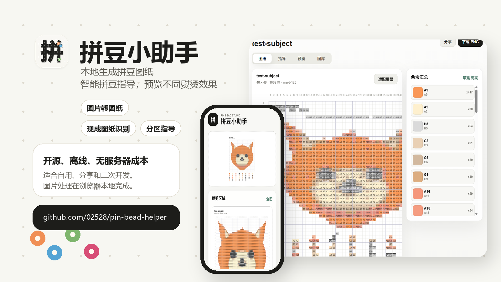
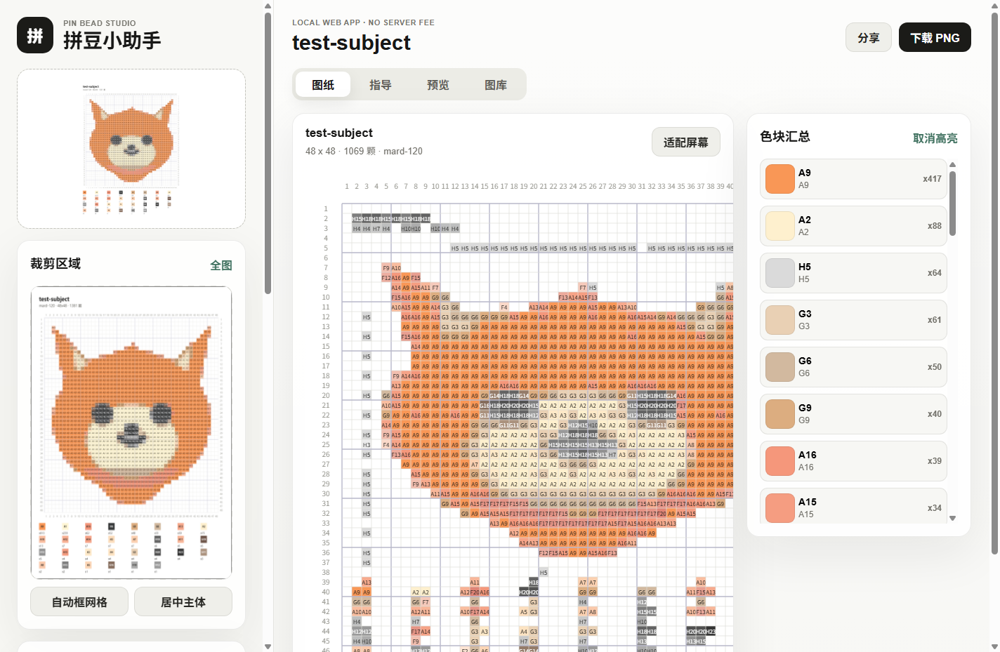
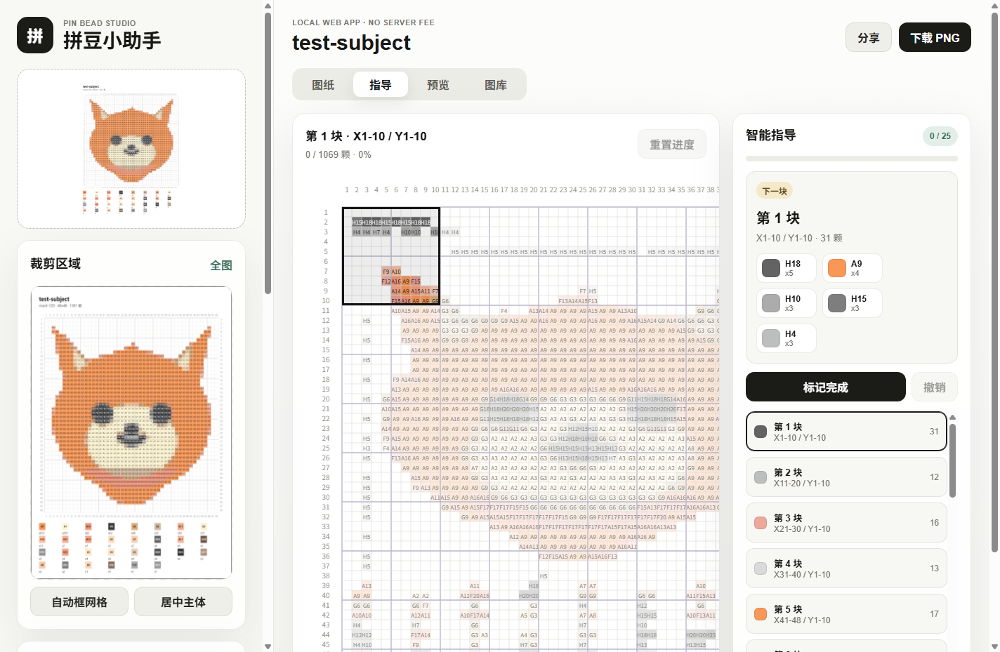
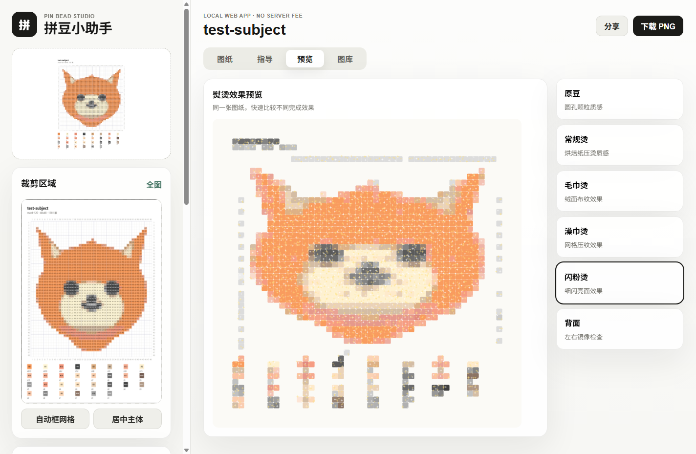
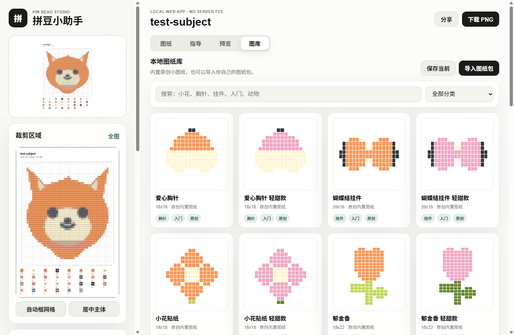
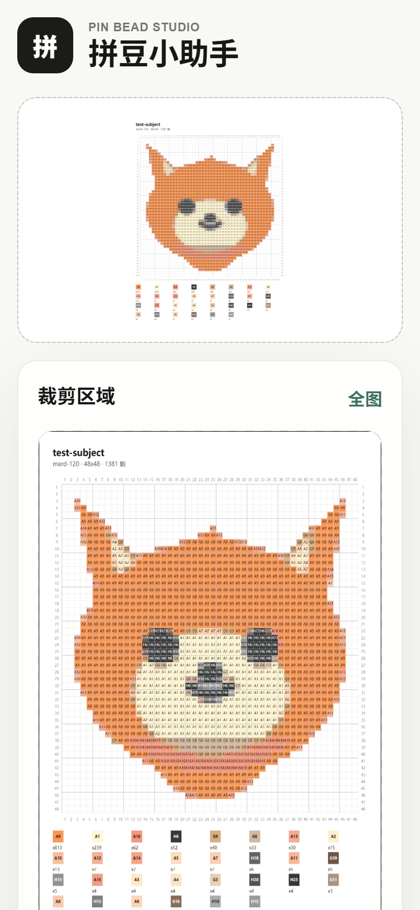

# 拼豆小助手



拼豆小助手是一个开源、离线、无服务器成本的拼豆图纸工具。它可以把普通图片转换成带坐标轴和色号的拼豆图纸，也可以导入现成图纸进行识别，并提供色块统计、分区拼豆指导、熨烫效果预览和 PNG 导出。

适合拼豆玩家自用、分享给朋友，也适合开发者继续二次开发成 Web App、安卓 App 或小程序形态。

## 界面预览

| 图纸编辑 | 智能指导 |
| --- | --- |
|  |  |

| 熨烫预览 | 本地图纸库 |
| --- | --- |
|  |  |

| 手机界面 |
| --- |
|  |

## 功能亮点

- 图片转拼豆图纸：本地读取图片并生成网格图纸，图片不会上传服务器。
- 自由裁剪区域：可以选择图片里真正要做成拼豆的部分，自动建议格数，尽量不拉伸原图。
- 现成图纸识别：导入已有拼豆图纸后，自动识别网格、色块和色号，并支持忽略水印干扰。
- 色库与套餐：支持 MARD / Artkal 风格色库，以及 96 / 120 / 144 / 168 / 221 色预设。
- 色号高亮：点击某个色号即可高亮对应位置，缺哪种豆、先拼哪一色更清楚。
- 拼豆指导模式：把图纸自动切成小块，可以按区块标记完成，适合边看手机边拼。
- 熨烫效果预览：提供原豆、常规烫、毛巾烫、澡巾烫、闪粉烫、背面等效果预览。
- 高清 PNG 导出：导出的图纸包含坐标轴、每格色号和底部色块汇总。
- 安卓壳工程：内置 Android WebView 包装工程，可以直接打包成 APK。

## 本地运行网页版

需要安装 Node.js。

```bash
npm start
```

默认地址：

```text
http://127.0.0.1:4173/
```

## 运行测试

```bash
npm test
```

## 构建 Android APK

需要安装 JDK 17 和 Android SDK。第一次构建建议在 `android` 目录使用 Gradle Wrapper：

```bash
cd android
./gradlew assembleDebug
```

Windows PowerShell：

```powershell
cd android
.\gradlew.bat assembleDebug
```

生成的调试包位置：

```text
android/app/build/outputs/apk/debug/app-debug.apk
```

## 开源说明

本项目使用 MIT License 开源。

图库和图纸内容请只使用原创、已授权或用户自己导入的素材。项目不包含第三方付费图纸抓取功能。
